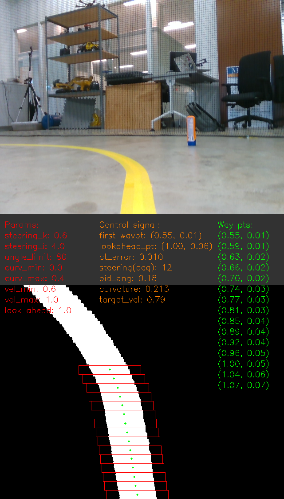

## Execution
```
$ python3 rgb_tracker.py

$ rosbag play -l <bag_path> # play ros bag in another terminal
```

## Debug
1. Check `params.txt`. (Under each image directory, there is a params.txt for params record)
2. Update arguments in `rgb_tracker.py`
3. Execution debug_helper.py
    ```
    python debug_helper.py -i <input_dir>
    ```
    input_dir should contain images you want to debug. Please refer to `debug_helper.py` to check other possible arguments.
4. Visualization results will be output to `./debug_results/debug_results_new`.
    
    ex:

    